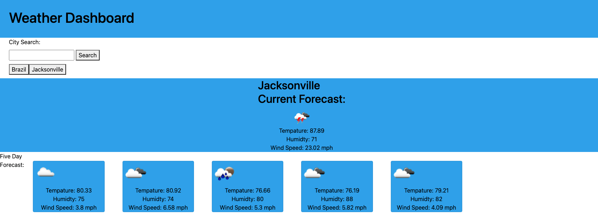

# Weather-Dashboard

## Overview

Welcome to Weather Dashboard, a user-friendly web application that provides real-time weather information and a five-day forecast for any city around the world. With an intuitive interface and reliable data sources, Weather Dashboard helps you stay informed about current and upcoming weather conditions.

## Features

Current Weather: Enter the name of your city in the search bar to instantly view the current weather conditions. Get accurate details such as temperature, humidity, wind speed, and direction, along with a concise weather description.

## Five-Day Forecast:

Plan ahead with the five-day forecast feature. Weather Dashboard provides a comprehensive overview of predicted weather conditions for the next five days. Stay informed about high and low temperatures, precipitation chances, and any special weather advisories or warnings.

## Global Coverage:

Weather Dashboard covers cities worldwide, allowing you to access weather information for any location you desire. Whether you're traveling or want to check on weather conditions in a different region, we've got you covered.

## Easy-to-Use Interface:

Our user-friendly interface ensures a seamless experience for users of all levels. The intuitive design makes it easy to search for cities and retrieve weather information quickly.

## Display

## Usage

[Weather Dashboard](https://justinryan8828.github.io/Weather-Dashboard/)
